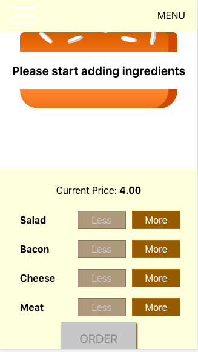

## Burger Builder
A React single-page app which allows the user to add ingredients to the burger. 
The SPA has also been adjusted to fit both desktop and mobile devices.

This project was bootstrapped with [Create React App](https://github.com/facebook/create-react-app).

#### `npm start`

Runs the app in the development mode. 
Open [http://localhost:3000](http://localhost:3000) to view it in the browser.

The page will reload if you make edits. 

